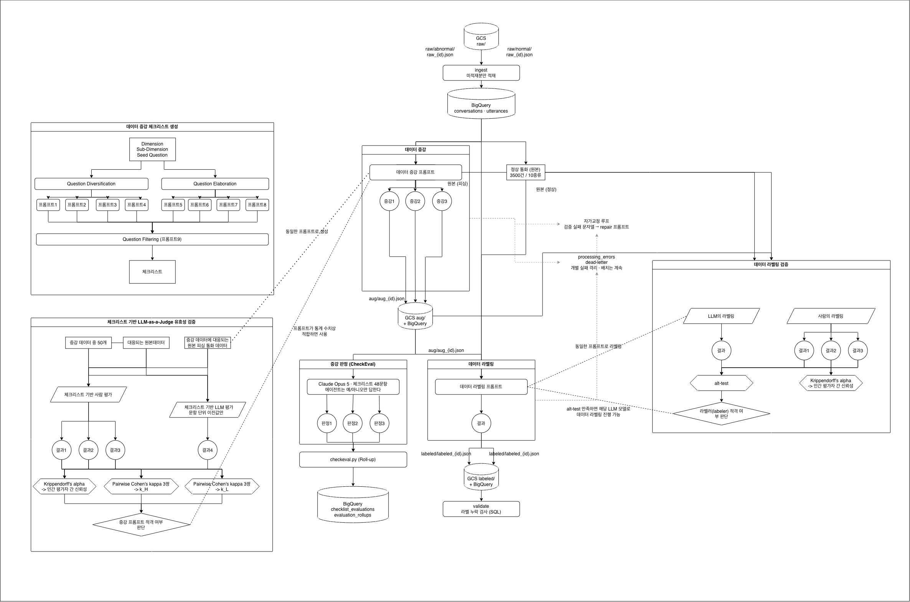

# Real-Time Voice Phishing Detection

This repository accompanies the paper:

**LLM 기반 대화 증강과 문맥 기반 발화 단위 라벨링을 통한 실시간 보이스피싱 탐지**
(Real-Time Voice Phishing Detection through LLM-Based Dialogue Augmentation and Context-Aware Utterance-Level Labeling)

Suheum Jeong, Damin Lee, Jiye Lim, Harksoo Kim (corresponding author)
Department of Computer Science and Engineering, Konkuk University

> Accepted for poster presentation at the 38th Annual Conference on Human and Cognitive Language
> Technology (HCLT 2026).

## Overview

Most prior work classifies a phone call as voice phishing only after the call has ended, or slices the
transcript into fixed-size blocks that cannot see earlier context. This work instead makes a judgment
every 5 utterances using the full context accumulated from the start of the call, and issues a final
call-level verdict once the call ends.

Three components are combined:

- **LLM-based dialogue augmentation.** Real phishing transcripts are scarce, so each call is rewritten
  into three variants that preserve the scam intent, tactics, and speaker roles while varying wording,
  sentence structure, and tone. Augmentation quality is screened with a 48-item binary checklist judged
  by an LLM whose reliability is verified against human raters.
- **Context-aware utterance labeling.** The labeling prompt instructs the model to judge each
  utterance i on utterances 1..i only, so that later parts of the call do not inform earlier
  judgments. The reliability of the LLM annotator is verified with inter-rater agreement and the
  Alternative Annotator Test.
- **Cumulative-context training samples.** Every intermediate sample contains the transcript from the
  first utterance up to the judgment point, unlike fixed-window approaches where earlier utterances
  fall outside the input.

Four lightweight causal language models are fine-tuned with QLoRA under an identical input/output
format and decision rule, showing that the method works consistently regardless of model family or
parameter count.

## Main Results

Cumulative-context performance before and after fine-tuning (%). All four models improve
consistently in F1 and AUPRC.

| Model | Condition | Precision | Recall | F1 | AUPRC |
|---|---|---:|---:|---:|---:|
| Qwen3.5 | before | 13.93 | 99.35 | 24.44 | 42.18 |
| Qwen3.5 | after | 93.02 | 94.62 | 93.82 | 97.88 |
| Ministral | before | 38.59 | 41.08 | 39.79 | 39.34 |
| Ministral | after | 96.69 | 94.19 | 95.42 | 98.38 |
| EXAONE | before | 14.00 | 99.78 | 24.56 | 54.59 |
| EXAONE | after | 95.16 | 93.12 | 94.13 | 97.93 |
| Mi:dm | before | 53.84 | 98.06 | 69.51 | 90.80 |
| Mi:dm | after | 99.30 | 91.18 | 95.07 | 98.30 |

Early-detection analysis (Table 3 in [`docs/results.md`](docs/results.md)) shows that after
fine-tuning the models detect most calls within a short span of the first risk signal, with fewer
pre-signal positives and stable judgments after the first detection.

## Method


Figure 1 of the paper (labels in Korean). Each call's utterances carry a context-aware risk label.
Cumulative-context samples are emitted every five utterances, labeled with the maximum risk label
seen so far, and the whole call is emitted once as a separate sample. Every sample is a prompt of
the instruction plus the conversation, and the fine-tuned causal language model decides by comparing
the next-token probabilities of "0" and "1".

## Data Construction Pipeline



How the corpus was built: each phishing call is augmented into three variants, every candidate is
screened with the 48-item checklist, and the surviving calls are labeled utterance by utterance
under the temporal rule. Two human studies validate the checklist judge and the LLM annotator
(Alternative Annotator Test). Details are in [`docs/data.md`](docs/data.md) and
[`docs/checklist.md`](docs/checklist.md).

## Repository Structure

This repository is the hub for the paper. It holds the method description, data specification,
checklist artifact, measured results, and reproduction guide. Runnable code lives in the
per-stage repositories linked below.

| Path | Contents |
|---|---|
| [`docs/data.md`](docs/data.md) | Source data, augmentation, labeling, sample construction, schema |
| [`docs/checklist.md`](docs/checklist.md) | Checklist construction and LLM judge validation |
| [`docs/experiments.md`](docs/experiments.md) | Models, hyperparameters, environment |
| [`docs/reproduce.md`](docs/reproduce.md) | Stage-by-stage method walkthrough |
| [`docs/results.md`](docs/results.md) | Full results and analysis |
| [`docs/references.md`](docs/references.md) | Bibliography |
| [`checklist/chk_v3.jsonl`](checklist/chk_v3.jsonl) | The 48-item checklist (in Korean) |
| [`src/`](src/) | Prompt assembly, truncation, metrics, per-model loading |
| [`scripts/`](scripts/) | Sample construction, QLoRA fine-tuning, evaluation |
| [`configs/`](configs/) | Per-model training and evaluation settings |
| [`data/quality/`](data/quality/) | Ids excluded by the augmentation quality filter |
| [`tests/`](tests/) | Checks for the answer-token boundary and truncation |
| [`prompts/`](prompts/) | All prompts used for augmentation, labeling, and judging |
| [`assets/`](assets/) | Figures from the paper |

## What This Repository Contains

Released here:

- **Prompts** for every LLM stage: augmentation, utterance labeling, checklist judging, and
  checklist construction ([`prompts/`](prompts/))
- **The 48-item quality checklist** written by the authors ([`checklist/`](checklist/))
- **Method and experimental detail**: data construction, hyperparameters, decision rule, and the
  results reported in the paper ([`docs/`](docs/))

Not released: the call corpus and the fine-tuned LoRA adapters. The source transcripts come from
the [FSS voice phishing experience gallery](https://www.fss.or.kr/fss/bbs/B0000206/list.do?menuNo=200690)
and from three [AI-Hub](https://aihub.or.kr/) counseling corpora
([Call Center Q&A](https://aihub.or.kr/aihubdata/data/view.do?dataSetSn=98),
[Counseling Speech](https://aihub.or.kr/aihubdata/data/view.do?dataSetSn=100),
[Civil Counseling LLM](https://aihub.or.kr/aihubdata/data/view.do?dataSetSn=71844)), both of which
restrict redistribution. [`docs/data.md`](docs/data.md) documents the sources, the cleaning rules,
and the sample schema so the corpus can be rebuilt from the originals.

## Data Composition

| Split | Rows | Cumulative-context | Whole-call | Calls | Augmented calls |
|---|---:|---:|---:|---:|---:|
| train | 26,760 | 23,425 | 3,335 | 3,335 | 627 |
| valid | 4,892 | 4,306 | 586 | 586 | 0 |
| test | 4,514 | 3,940 | 574 | 574 | 0 |

Splits are made at the call level before sample construction, so samples derived from one call never
cross splits. Augmented calls follow their origin call's split and are used for training only.

## Fine-Tuning and Evaluation

The training and evaluation code used for the paper is in this repository. Each model is fine-tuned
with QLoRA on the same data, objective, and hyperparameters, listed in
[`docs/experiments.md`](docs/experiments.md).

```bash
pip install -r requirements.txt

# QLoRA fine-tuning; substitute qwen, ministral, exaone, or midm
python scripts/train_lora.py --config configs/<model>/lora_train_config.json

# evaluation before fine-tuning
python scripts/evaluate_model.py --config configs/<model>/baseline_eval_config.json

# evaluation after fine-tuning
python scripts/evaluate_model.py --config configs/<model>/finetuned_eval_config.json
```

The configs expect the corpus at `data/final/{train,valid,test}.jsonl` and the model weights under
`models/<model>/`. Neither is included here; [`docs/data.md`](docs/data.md) gives the sample schema
so the files can be rebuilt from the original sources.

Training masks the prompt tokens and computes the loss only on the answer token. At inference the
next-token log probabilities of the candidates "0" and "1" are compared directly, so no generated
text is parsed and the identical decision rule applies to every model, before and after fine-tuning.
Inputs over the maximum length are truncated from the front of the conversation, keeping the
instruction and the most recent context.

[`docs/reproduce.md`](docs/reproduce.md) walks through all four pipeline stages, including the
augmentation and labeling steps that precede training.

## Citation

```bibtex
@inproceedings{vpdetect2026,
  title     = {LLM 기반 대화 증강과 문맥 기반 발화 단위 라벨링을 통한 실시간 보이스피싱 탐지},
  author    = {Jeong, Suheum and Lee, Damin and Lim, Jiye and Kim, Harksoo},
  booktitle = {Proceedings of the 38th Annual Conference on Human and Cognitive Language Technology (HCLT)},
  year      = {2026}
}
```

## References

Key methods this work builds on:

- CheckEval: checklist-based LLM-as-a-Judge evaluation (Lee et al., EMNLP 2025)
- Alternative Annotator Test: statistical justification for replacing a human annotator with an LLM
  (Calderon, Reichart, and Dror, ACL 2025)
- LoRA (Hu et al., 2022) and QLoRA (Dettmers et al., 2023) for parameter-efficient fine-tuning

The full bibliography is in [`docs/references.md`](docs/references.md).

## License

Code and documentation are released under the [MIT License](LICENSE). The license does not cover the
source call data, which remains subject to the terms of the FSS and AI-Hub.
