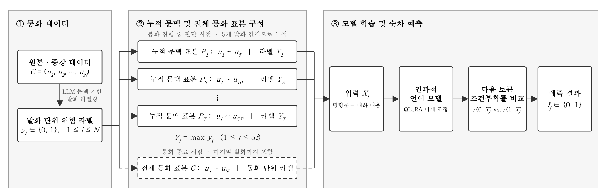

# Experimental Setup

## 1. Problem Formulation




No classification head is added. The next-token prediction probability of a causal language model is
used directly.

**Training.** Input tokens for the instruction and the transcript are masked out of the loss; the
cross-entropy loss is computed only on the answer token, "0" or "1".

```
L = - sum over (X_j, l_j) in D of log p_theta(l_j | X_j)
```

**Inference.** No generated text is parsed. At the next-token position right after the input, the
conditional probabilities assigned to the two answer candidates are compared directly:

```
l_hat_j = argmax over c in {0, 1} of p_theta(c | X_j)
```

This has two benefits. Output-format collapse or parsing failures cannot contaminate the metrics,
and because there is no model-specific head, **the same input/output format and decision rule apply
to every causal language model**.

## 2. Models

| Model | Parameters | Architecture class |
|---|---:|---|
| Qwen3.5-2B-Base | 2B | `Qwen3_5ForConditionalGeneration` |
| Ministral-3-3B-Base-2512 | 3B | `Mistral3ForConditionalGeneration` |
| EXAONE-4.0-1.2B | 1.2B | `Exaone4ForCausalLM` |
| Mi:dm-2.0-Mini-Instruct | ~2B | `LlamaForCausalLM` |

Mi:dm is the only instruction-tuned checkpoint; the rest are base models. Qwen and Ministral are
multimodal conditional-generation checkpoints that `AutoModelForCausalLM` cannot load, so loading is
dispatched per model family. LoRA is applied to the **text backbone only**; the target modules are
constrained by regex and verified before training so that no adapter lands on a vision tower or MTP
head.

## 3. Training Configuration

QLoRA is used to fit the training in limited compute: the pretrained weights are quantized to 4-bit
NF4 and frozen, and only low-rank adapters are trained.

| Item | Value |
|---|---|
| Quantization | 4-bit NF4 with double quantization |
| Compute dtype | bfloat16 |
| LoRA rank / alpha / dropout | 16 / 32 / 0.05 |
| LoRA targets | attention and MLP of the text backbone |
| Micro batch x grad accumulation | 2 x 16 (effective batch 32) |
| Learning rate | 1e-4 |
| Warmup ratio / weight decay | 0.03 / 0.01 |
| Epochs | 3 |
| Max sequence length | 2,048 |
| Gradient checkpointing | on |
| GPU memory cap | 44 GiB |

All four models share the same training data, objective, and hyperparameters.

### Answer token boundary

The answer is never appended as a string and re-tokenized. The token ID of "0" or "1" is concatenated
directly after the tokenized prompt, and the loss mask sets the prompt region to -100. This
structurally rules out the boundary drift that string concatenation plus re-tokenization can cause.

## 4. Evaluation Configuration

| Item | Value |
|---|---|
| Decision rule | label scoring: argmax(log P("0"), log P("1")) |
| Batch size | 1 |
| Max sequence length | 2,048 |
| Primary metrics | precision, recall, F1 (label 1), AUPRC |

**Why AUPRC is reported.** The positive ratio of the evaluation data is low, so accuracy alone
overstates performance: predicting all negatives already scores high. A threshold-free metric is
reported alongside the thresholded ones.

**Early detection.** The first cumulative-context sample where the model predicts 1 defines the
first-detection point. Every prediction is made independently; outputs after the first detection are
**not** clamped to 1, so both detection speed and post-detection reversal can be measured.

## 5. Input truncation

Inputs longer than `max_length` (2,048 tokens) are truncated by removing the front of the
conversation while keeping the classification instruction and the answer format, so the most recent
context is preserved. The same rule is applied to training, validation, and test inputs. Measured
per each model's tokenizer, truncation affected 9.25 to 12.12 percent of the cumulative-context
samples and 9.16 to 21.97 percent of the whole-call samples.

## 6. Environment

| Item | Value |
|---|---|
| GPU | NVIDIA RTX 6000 Ada Generation 48GB x 1 |
| CUDA | 12.8 |
| PyTorch | 2.10.0+cu128 |
| Transformers | 5.5.0 |
| PEFT | 0.18.1 |
| bitsandbytes | >= 0.46 |
| Python | 3.12 |

### Reproducibility notes

- **Batch size 1 is deliberate.** Larger batches introduce padding, which changes tensor shapes and
  therefore bfloat16 kernel paths; log probabilities near the decision boundary shift and a small
  number of predictions flip.
- **A single GPU model is used throughout.** Changing the GPU changes kernel paths and can flip
  boundary samples. All reported runs used one RTX 6000 Ada.
- Restricting the forward pass to the last position (`logits_to_keep`) produces identical scores for
  unpadded single rows.

## 7. Analysis Tooling

The result tables are produced from the saved evaluation predictions. Table 2
comes from the evaluation output of each model; Table 3 comes from the early-detection analysis over
the test-split phishing calls. Predictions are joined to test metadata by the unique `sample_id`,
never by row order, so reordering the evaluation file cannot corrupt the analysis.
